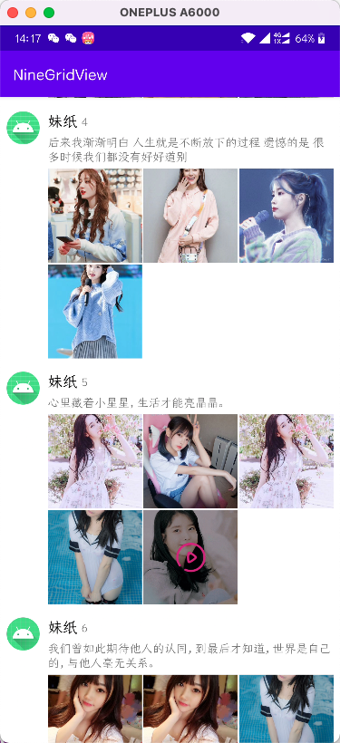

# NineGridView

可能是最通用的九宫格布局，不仅仅能显示图片，ItemView可自定义，类似RecyclerView。

* 正常九宫格视图，仿微信，Item显示样式可完全自定义
* 超过9个Item，可自定义额外展示的布局
* 自定义适配单个，两个，三个，四个item视图显示样式
* 自定义item间的间距

## 预览

### 一个Item

| usual                           | fill                            | custom                          |
| ------------------------------- | ------------------------------- | ------------------------------- |
|  |  |  |

### 两个Item

| usual                           | fill                            |
| ------------------------------- | ------------------------------- |
|  |  |

### 三个Item

| usual                        | bili                         |
| ---------------------------- | ---------------------------- |
|  |  |

### 四个Item

| usual                          | fill                           | bili                           |
| ------------------------------ | ------------------------------ | ------------------------------ |
|  |  |  |

### 其他

| 额外布局                      | 多类型                            |
| ----------------------------- | --------------------------------- |
|  |  |

## 依赖

[](https://jitpack.io/#simplepeng/NineGridView)

```groovy
maven { url 'https://jitpack.io' }
```

```groovy
implementation 'com.github.simplepeng:NineGridView:1.0.4'
```

从`1.0.4`版本开始，版本号前面不用加`v`

## 使用

继承`NineGridView.Adapter()`，重写需要的方法，具体可查看demo中的使用方法。

```kotlin
class CustomAdapter : NineGridView.Adapter()
```

```kotlin
abstract class Adapter {

    // 返回总的item数量
    abstract fun getItemCount(): Int

    //分发各种不同itemType，类似RecyclerView
    fun getItemViewType(position: Int) = 0

    //默认的ItemView样式
    abstract fun onCreateItemView(parent: ViewGroup, viewType: Int): View

    abstract fun onBindItemView(itemView: View, viewType: Int, position: Int)

    //适配单个ItemView的样式
    open fun onCreateSingleView(parent: ViewGroup, viewType: Int): View? = null

    open fun onBindSingleView(singleView: View, viewType: Int, position: Int) {

    }

    //适配额外的View的样式
    open fun onCreateExtraView(parent: ViewGroup, viewType: Int): View? = null

    open fun onBindExtraView(extraView: View, viewType: Int,  position: Int) {

    }
}
```

可使用的属性

```xml
app:ngv_spanCount                   //横向的item数量，默认为3
app:ngv_itemGap                     //item间的间距，默认为1dp
app:ngv_maxCount                    //最多显示的item数量，默认为9
app:ngv_single_strategy             //一个item的显示样式
app:ngv_two_strategy="usual"        //两个item的显示样式
app:ngv_three_strategy              //三个item的显示样式
app:ngv_four_strategy               //四个item的显示样式
app:ngv_extra_strategy              //是否显示额外布局
```

如果不需要自定义的ItemView，也可以直接使用本库封装好的`ImageAdapter`，效果就是预览图那种。

```kotlin
val imageAdapter = ImageAdapter(item.images, onBindView = { imageView, item, position ->
    Glide.with(imageView)
        .load(item)
        .centerCrop()
        .into(imageView)
})
imageAdapter.onItemViewClick = { item, position ->
    toast("ItemView click -- $position")
}
imageAdapter.onExtraViewClick = { position ->
    toast("ExtraView click  $position")
}
holder.nineGridView.adapter = imageAdapter
```

## 感谢各位大佬打赏🙇🙇🙇！

您的支持是作者努力更新的动力。万水千山总是情，10.24我看行！

|  |  |  |
| ------------------------------------------------------------ | ----- | ----- |

[打赏链接](https://simplepeng.com/merge_pay_code/) | [赞助列表](https://simplepeng.com/Sponsor/)

## 版本迭代

* 1.0.4：修复递归调用`performBind`的问题，增加`viewCache`
* v1.0.3：修复bug
* v1.0.2:
  * 支持更多显示类型
  * 支持多itemViewType
  * 抽出Adapter属性到attrs.xml 
* v1.0.1：
  * 修改属性名，预防和其他View的属性冲突
  * 增加`ImageAdapter`
  * 去掉`BuildConfig.java`
  * 增加`isInEditMode`，在布局编辑状态也可以预览样式
* v1.0.0：初次上传

